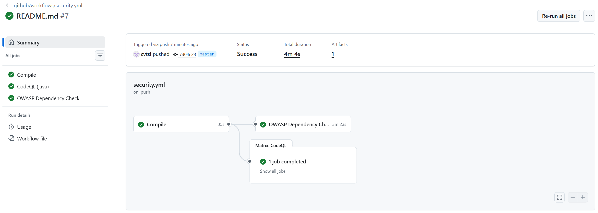

# Лабораторная работа 1: Разработка защищенного REST API с интеграцией в CI/CD

## Описание
В данной работе реализован минимальный REST API на фреймворке Jakarta EE 11 с использованием сервера приложений WildFly.
### Доступные эндпоинты
1. Авторизация пользователя
   * Метод `POST`
   * URL: `/auth/login`
   * Принимает логин и пароль, проверяет их и возвращает JWT-токен, позволяющий взаимодействовать с прочими эндпоинтами.
   * Тело запроса (JSON)
     ```json
     {"login": "username", "password": "Password123"}
     ```
   * Пример вызова (cURL)
     ```sh
     curl -X POST http://localhost:8080/deployment-name/auth/login \
          -H "Content-Type: application/json"                      \
          -d '{"login":"demo", "password":"demo123"}'
     ```
2. Получение данных
   * Метод `GET`
   * URL: `/api/data`
   * Возвращает JSON-массив всех сохраненных данных для текущего пользователя.
   * Заголовки: `Authorization: Bearer <jwt-токен>`
   * Пример вызова (cURL)
     ```sh
     curl -X GET http://localhost:8080/deployment-name/api/data \
          -H "Authorization: Bearer aaaaaaaaaa..."
     ```
3. Сохранение данных
   * Метод `POST`
   * URL: `/api/data`
   * Сохраняет произвольный JSON-объект для текущего аутентифицированного пользователя
   * Заголовки:
     ```
     Authorization: Bearer <jwt-токен>
     Content-Type: application/json
     ```
   * Пример вызова (cURL)
     ```sh
     curl -X POST http://localhost:8080/deployment-name/api/data \
          -H "Authorization: Bearer aaaaaaaaaa..."               \
          -H "Content-Type: application/json"                    \
          -d '{"key": "value", "nested": {"items": [1, 2, 3]}}'
     ```
### Меры защиты
* Сервер не использует сессии (JSESSIONID, аннотация @AutoApplySession), что исключает уязвимости, связанные с фиксацией сессий.
* Издаваемые токены подписываются алгоритмом HMAC-SHA256 с использованием хранимого на сервере секрета.
  Это гарантирует, что злоумышленник не сможет подделать токен.
* Реализован HttpAuthenticationMechanism.
  При каждом запросе к /api/* механизм извлекает токен из заголовка `Authorization: Bearer ...`, проверяет подпись и срок действия,
  после чего сообщает контексту безопасности о пользователе и его правах.
* Декларативная авторизация: Доступ к бизнес-логике ограничен аннотацией @RolesAllowed("USER").
* Взаимодействие с базой данных осуществляется исключительно через EntityManager и язык запросов JPQL.
  Провайдер реализации JPQL автоматически экранирует специальные символы и передает параметры отдельно от тела SQL-запроса.
* Ответы API возвращаются с заголовком `Content-Type: application/json`.
  Современные браузеры не исполняют JavaScript-код, полученный в ответах XHR/Fetch с типом application/json.

## Скриншот успешного прохождения пайплайна

https://github.com/cvtsi/infosec-lab1/actions/runs/36459438103